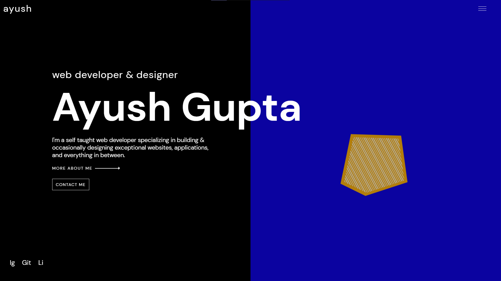

<h1 align="center">
  ayushguptaa.com- v1 👾
</h1>



## Requirements ⚠

For development, you will only need Node.js and a node global package, Yarn, installed in your environement.

## 🛠 Installation & Set Up

1. Install dependencies 📦

   ```sh
   npm install
   ```

2. Start the development server 🚀

   ```sh
   npm run nodemon
   ```
